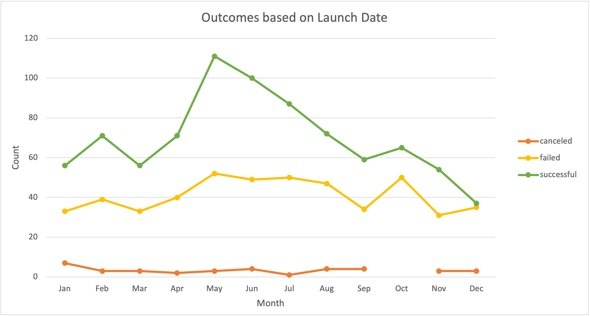

# Kickstarting with Excel

## Overview of Project

The entirety of this project’s files (both empty and completed) can be found at [https://github.com/luperrin/01-kickstarter-analysis-lukeperrin.git](https://github.com/luperrin/01-kickstarter-analysis-lukeperrin.git).

### Purpose

This project was designed to outline basic functions and features of Excel for the purpose of organizing, restructuring, and processing datasets for statistical analysis and visualization. Working with large sets of data can be difficult to interpret with the naked eye, however Excel offers a way to manipulate the way in which you can view large datasets through its many data processing tools and functions.

This functionality was practiced by looking at a [large collection of data](StarterBook.xlsx) that contains 4,115 tuples of input, each capturing the outcome of a kickstarter project and the parameters surrounding each success or failure. In this scenario, a playwright, Louise, is seeking to raise over $10,000 through crowdfunding for her new play _Fever_. Louise is looking to use this dataset to help her decide how she should go about funding her play, and present this funding strategy to her patrons as incentive to give donations with confidence.

With the purpose of providing this analysis to Louise, we will look to review, analyze, and present an interpretation of this dataset that assesses the factors correlated with historically successful kickstarter funding campaigns.

## Analysis and Challenges

### Strategic Approach and Initial Review

When looking at a new dataset, it is important to fully understand what (and how) data is represented in order to properly wrangle it for the purpose of answering specific questions. In doing so, it becomes easier to build a data interpretation strategy and determine what fields are, and are perhaps not, important to your task. The initial review of the dataset includes the following steps:

1. Enable an appropriately scaled window overviewing the dataset by zooming out enough to be able to see as many fields as possible, but not so far that individual records are illegible.
2. Assess the fields (*i.e.* columns that group the data into types) that are represented by the dataset. Understand how each field may (or possibly, may not) contribute to your interpretation task. Make note of the key metrics that directly address your task, then prioritize the remaining fields as factors that correlate to those key metrics. For each of these, determine what factors are controlled (those that Louise has the ability to incorporate into her strategy) and those that are environmental variables (those that Louise cannot change). 

    Variables that Louise has control of and can use to influence uncontrollable variables:
     - `goal` is a **key metric** that represents the crowdfunding goal which Louise can set
     - `launched_at`, `name`, and `blurb` are factors Louise can change that may impact outcomes.

    Uncontrollable variables, that Louise would like to influence toward a desired outcome :
     - `outcome` represents a **key metric** that we are looking to define correlations to and influence toward `successful`
     - `pledged` could be a **key metric**, and to a lesser extent `backers_count`, as Louise would like to maximize these values
     - `staff_pick` and `spotlight` are outcomes that are desired, but not as critically impacted by funding as the two previously mentioned.

    Environmental variables that Louise has no control over, that may or may not impact outcomes:
     - fields like `country` and `Category and Subcategory` are immutable in this context, however we may use these fields to define a relevant sample of the dataset.

3. Using the data wrangling tools Excel is equipped with, begin looking for correlations in the data based on the fields noted in the step above. Begin by filtering and sorting the data on these fields, then introduce more variables as you find correlations. Once correlations are established that address the question at hand, begin generating focused views (charts, graphs, or tables) of the data that highlight these correlations.

4. All fields are prepared for analysis by ensuring that the cells in those fields are relevant to the variables of interest, are legible by human and/or Excel function, and are exposed to be used in batch analysis. The following two transformations were applied to our [StarterBook](StarterBook.xlsx) to ensure readability:

   * both the `launched_at` and `deadline` fields were converted from Unix timestamp format into standardized *MM/DD/YYYY* format by creating two new columns (`Date Created Conversion` and `Date Ended Conversion`, respectively). In each, the conversion was accomplished by using the following input into each cell (respective to their REF).
     
     `=(((REF/60)/60)/24)+DATE(1970,1,1)`
   
   By filling down, each cell in the source fields was transformed, however a different string of non-sensical numbers was now present. Those cells need formatted properly as well, and is done so by selecting both columns, hitting `CTRL/CMD + 1` and selecting 'Date' as the proper format option.

   * Secondly, the field `Catergories and Subcategories` would definitely yield better use if each item had its own field. This is accomplished by selecting that column, navigate to 'Data > Text to Columns'. Upon clicking, the text import wizard opens allowing to select the appropriate delimiter (`/`), and formatting the output as 'Text'. Once this is accomplished, the original column `Catergories and Subcategories` now only contains categories, and a new untitled column contains the subcatergories. Each field is renamed to `Category` and `Subcategory` respectively.

The steps described above were established by the course module's instructions. Having followed the prompts listed there, the results listed in the following section were obtained.

### Analysis of Outcomes Based on Launch Date

The following steps were taken to isolate the relationship between `outcome` and `Date Created Conversion`:

1. From the ‘*Kickstarter*’ worksheet, a new PivotTable is generated in a new worksheet which is renamed ‘*Outcomes based on Launch Date*’.

2. In the PivotTable fields, the following parameters are applied:

   - **Filters**: `Category` and `Years`*

   - **Legend (Series)**: `outcome`

   - **Axis (Categories)**: `Date Created Conversion`

   - **Values**: `Count of outcome` (from `outcome`)

     \* *when `Date Created Conversion` is set into the PivotTable fields, `Years` and `Quarters` are both automatically generated. `Quarters` is disposed.*

3. On the PivotTable, the following are applied by using the field dropdown windows:

   - `Category` is filtered so that `theater` values are isolated.
   - *Column Labels* filters out `live` values.
   - *Column Rows* sorts `Date Created Conversion` values in ascending order (so that the list run from `Jan` to `Dec`, top to bottom of the table.

4. While the PivotTable is selected, navigate to ‘PivotTable Analyze > PivotChart’ to generate a bar graph (default). 

5. With the graph selected, navigate to ‘Design > Change Chart Type’ and select *Line with Markers* under the ‘Line’ dropdown.

6. While still under ‘Design’, Chart and Axis Labels are added by clicking the ‘Add Chart Element’ dropdown menu.

7. The image is saved as `Outcomes_vs_Launch.png` by right-clicking the chart then clicking ‘Save as Picture…’.

### Analysis of Outcomes Based on Goals

The following steps were taken to isolate the relationship between `outcome` and `goal`:

1. A new worksheet is renamed *Outcomes Based on Goals*’.

2. In this worksheet, a table is created to have the following rows:

   | Goal Range     |
   | :------------- |
   | Less than 1000 |
   | 1000 to 4999   |
   | 5000 to 9999   |
   | 10000 to 14999 |
   | 15000 to 19999 |
   | 20000 to 24999 |
   | 25000 to 29999 |
   | 30000 to 34999 |
   | 35000 to 39999 |
   | 40000 to 44999 |
   | 45000 to 49999 |
   | 50000 or More  |

3. The table headers are labeled as follows:

   *Number Successful*, *Number Failed*, *Number Canceled*, *Total Projects*, *Percentage Successful*, *Percentage Failed*, and *Percentage Canceled*.

   The source data will come from the ‘Kickstarter’ sheet, where:

   ​	`outcome` is found in `$F$2:$F$4115`;

   ​	and `goal` is found in  `$D$2:$D$4115`.

4. Using `COUNTIFS()` Excel function is helpful for counting values based on categorical criteria. However, due to the tediousness of typing this formula out for each cell, and manually selecting a reference, it was determined simpler to extract the values of interest into independent cells (see below).

|  A   |    B    |   C    |      D       |    E     | …    |
| :--: | :-----: | :----: | :----------: | :------: | ---- |
|  1   |    >    |   <    | `successful` | `failed` | …    |
|  2   |         | `1000` |              |          | …    |
|  3   | `1000`  | `4999` |              |          | …    |
|  …   |    …    |   …    |      …       |    …     | …    |
|  12  | `50000` |        |              |          | …    |

5. Now with our table prepared we can use the `COUNTIFS()` function to count the fields based on the references set by the row and column headers. Use the example table cell references to follow the example inputs below to fill down all of the values:
   **D2** = `=COUNTIFS(Kickstarter!$F$2:$F$4115,"=" & D$1,Kickstarter!$D$2:$D$4115,"<" & $C2)`

   **E2** = `=COUNTIFS(Kickstarter!$F$2:$F$4115,"=" & E$1,Kickstarter!$D$2:$D$4115,"<" & $C2)`

   **D3** = `=COUNTIFS(Kickstarter!$F$2:$F$4115,"=" & D$2,Kickstarter!$D$2:$D$4115,">" & $B3,Kickstarter!$D$2:$D$4115,"<" & $C3)`

   **E3** = `=COUNTIFS(Kickstarter!$F$2:$F$4115,"=" & E$2,Kickstarter!$D$2:$D$4115,">" & $B3,Kickstarter!$D$2:$D$4115,"<" & $C3)`

   **D12** = `=COUNTIFS(Kickstarter!$F$2:$F$4115,"=" & D$1,Kickstarter!$D$2:$D$4115,">" & $B12)`

   **E12** = `=COUNTIFS(Kickstarter!$F$2:$F$4115,"=" & E$1,Kickstarter!$D$2:$D$4115,">" & $B12)`.

6. *Total Projects* is calculated by taking the `=SUM()` of *Number Successful*, *Number Failed*,  and *Number Canceled*.

7. *Percentage Successful*, *Percentage Failed*, and *Percentage Canceled* are each calculated by:

   ​	*Percentage `outcome`* = (*Number `outcome`*/*Total Projects*) x 100

   ​	or in Excel function terms: `=(REF[`Number` outcome]/ REF[`Total Projects`]) *100`
   
   

### Challenges and Difficulties Encountered

Fortunately, I have learned much about Excel and its functions in my education and career. Navigating through the module did not prove too difficult. However, I did experience one major problem on the second deliverable.

Generating a line chart directly from the cells containing the functions (described above) yielded a highly erroneos plot. For some reason, the plotted points were inversely place on the *y*-axis (*i.e.* small percentages were placed closer to 100%, and large percentages were closer to 0%). The cell references seem to be fine, and oddly, hovering over the points plotted on the chart showed the correct values:

I was able to resolve this problem by simply copying the table and pasting it as *Values and Number Formatting*. I am still not sure why this happened, as I have never experienced this problem before.

## Results

The result charts are from each deliverable are displayed below:

***Deliverable 1:  Theater Outcomes vs Launch Date***

***Deliverable 2:  Outcomes vs Goal***

### Results Questions

1. ***What are two conclusions you can draw about the Outcomes based on Launch Date?***

>i.  Of campaigns whose `outcome` was `canceled`, there is no notable correlation between those `launched_at` values and their `outcome`s.

>ii.  There is a growth in the total number of campaigns launched between April and September, as well as October. Both `successful` and `failed` outcomes spiked during this period, so all that can be said about these months is that there are more theatric campaigns being launched these times of year.

2.  ***What can you conclude about the Outcomes based on Goals?***

>There is some correlation between small `goal`s and higher success `outcome`s. Necessarily, the inverse is true of `failed` and `canceled` kickstarters: there is a negative correlation between those rates and amount of funds set for the `goal`.

3.  ***What are some limitations of this dataset?***

>- How the sample was chosen for this dataset is unknown, though there is seemingly a highly disproportionate number of `successful ` campaigns : `failed` / `canceled` .
>- There are no data for reasons behind `successful ` /`failed` /`canceled` kickstarters. It would be difficult to make any definitive conclusions regarding funding and cause without some record of that actually contributing to the `outcome`.
>- Further subcategoritization (genres, durations, themes) would help assess if Louise’s play is fit for the market.
>- It concerns me that the `currency` field expresses a wide variety of international currencies. In this exercise, I was forced to assume that the units corresponding to both `goal` and `pledged` were standardized  through those data fields.

4.  ***What are some other possible tables and/or graphs that we could create?***

> - Filtering by `country` and investigating these correlations of that in which Louise is attempting to crowdfund.
> - Investigate `outcome` correlations isolated to each `Category` and `Subcategory` to see if there is better chance for Louise’s success in another entertainment industry.
